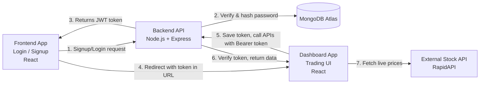
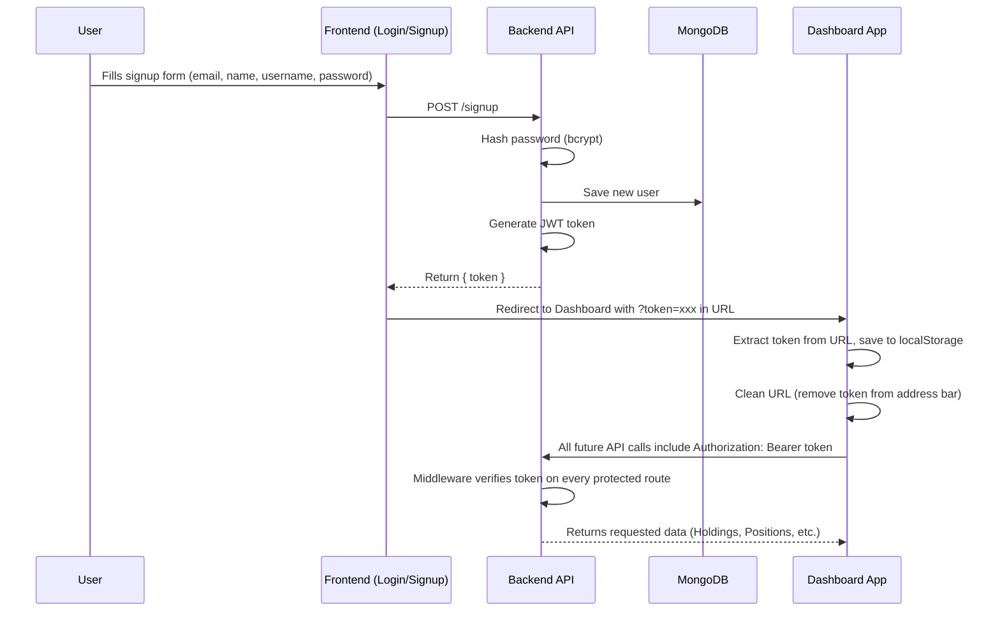
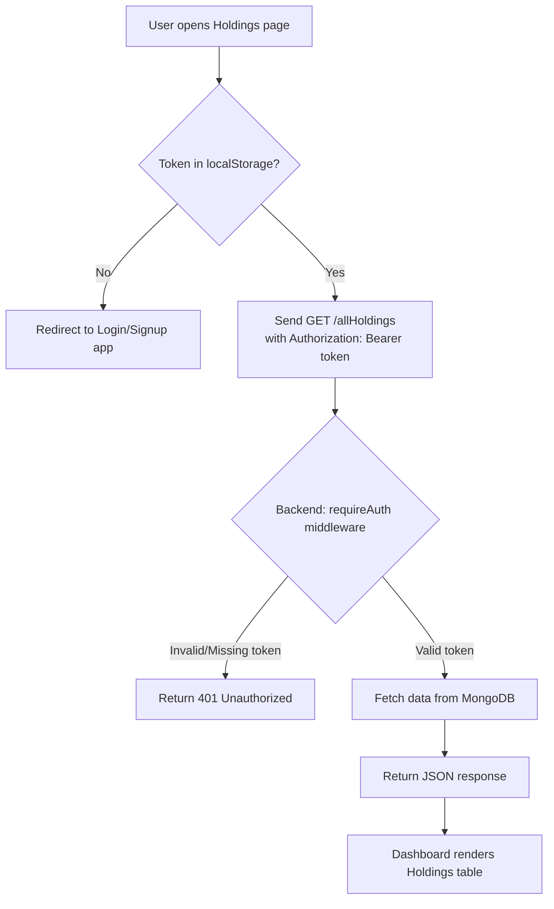

# 📊 Zerodha Clone — Full-Stack Stock Trading Dashboard

A full-stack stock trading dashboard inspired by Zerodha's Kite platform — built to go beyond a typical UI clone. It includes real JWT authentication, a live MongoDB database, protected REST APIs, real-time stock market data, and automated testing.

> ⚠️ **Disclaimer:** This is an unofficial project built purely for educational purposes. Not affiliated with, endorsed by, or connected to Zerodha Broking Ltd. in any way.

---

## 🔗 Links

- **Live Demo (Dashboard): https://zerodha-clone-web.vercel.app/
- **GitHub Repository: https://github.com/Abhayv273/ZERODHA-Clone.git
- **Video Walkthrough (Posted): https://www.linkedin.com/in/abhay-verma-36488325b/

⚠️ *Note: Live stock charts use a rate-limited free API — may occasionally show errors if the monthly quota is hit.*

---

## 📖 Table of Contents

- [Overview](#overview)
- [Features](#-features)
- [System Architecture](#-system-architecture)
- [Authentication Flow](#-authentication-flow)
- [Request Flow (Protected Routes)](#-request-flow-protected-routes)
- [Tech Stack](#-tech-stack)
- [Security Highlights](#-security-highlights)
- [Testing](#-testing)
- [What I Learned](#-what-i-learned)
- [Running Locally](#-running-locally)
- [Screenshots](#-screenshots)

---

## Overview

This project simulates a real trading platform end-to-end — from signing up a new user, to securely logging in, to viewing a live dashboard with holdings, positions, order history, and real-time stock price charts. Unlike most tutorial clones, this project treats authentication and API security as first-class concerns, and includes automated tests rather than relying purely on manual clicking.

The project is deliberately split into **three independently deployed applications** that communicate with each other — this mirrors how real-world systems are often architected (separate auth service, separate main app, separate API), rather than one single monolithic app.

---

## ✨ Features

- **Authentication** — Signup/login with hashed passwords (bcrypt) and JWT-based sessions
- **Protected Routes** — Both frontend routes *and* backend API endpoints require a valid token, not just one or the other
- **Dashboard Overview** — Portfolio summary with total investment, current value, and P&L
- **Watchlist** — Track stocks with live price and % change, plus a portfolio allocation doughnut chart
- **Buy / Sell Orders** — Place orders that are saved to MongoDB in real time
- **Holdings & Positions** — Full tables with Qty, Avg cost, LTP, Current Value, P&L, and daily change
- **Order History** — Track all past Buy/Sell activity
- **Funds** — View available margin, used margin, and account balance
- **Live Stock Analytics** — Click any stock to open a live price chart with real market data (current price, day range, year range, moving averages)
- **Automated Testing** — Unit and integration tests written with Jest
- **Three-app architecture** — Separate deployable apps for authentication and the trading dashboard, connected securely via token handoff

---

## 🏗️ System Architecture

The project consists of three independently deployed services:



**Why three separate apps instead of one?**
This mirrors real-world systems where authentication is often decoupled from the main application — similar to how large platforms separate an "accounts" service from the "product" service. It also forced me to solve a real problem: securely passing an authenticated session **across different origins/domains**, which a single combined app would never require.

---

## 🔐 Authentication Flow

Step-by-step flow of how a user signs up (or logs in) and ends up securely inside the dashboard:



**Key design decision:** Since the Frontend and Dashboard apps run on **different origins** (different domains/ports), `localStorage` cannot be shared between them directly. The token is passed once via a URL query parameter during redirect, then the Dashboard app immediately saves it to its own `localStorage` and strips it from the visible URL — avoiding both the cross-origin storage limitation and leaving a sensitive token exposed in the address bar.

---

## 🔄 Request Flow (Protected Routes)

What happens every time the Dashboard requests data (e.g., loading Holdings):



This same pattern (`requireAuth` middleware) is applied to every sensitive route — `/allHoldings`, `/allPositions`, `/newOrder`, `/newOrders` — so even if someone discovers the raw API URL and tries to call it directly (e.g., via Postman), they're rejected without a valid token.

---

## 🛠️ Tech Stack

| Category | Technologies |
|---|---|
| **Frontend** | React.js, React Router, Axios, Recharts |
| **Backend** | Node.js, Express.js |
| **Database** | MongoDB, Mongoose (ODM) |
| **Authentication** | JWT (jsonwebtoken), bcrypt.js |
| **Testing** | Jest |
| **External API** | RapidAPI — Indian Stock Exchange API (live market data) |
| **Deployment** | Vercel (Frontend + Dashboard), Render (Backend), MongoDB Atlas (Database) |
| **Version Control** | Git, GitHub |

---

## 🔐 Security Highlights

Most tutorial clones skip real security — this one doesn't:

- Passwords are **never stored in plain text** — hashed with bcrypt before saving to the database
- JWT tokens are signed with a secret key and expire after 7 days
- Backend middleware (`requireAuth`) rejects any API request without a valid token — verified by directly calling protected endpoints via Postman without an auth header and confirming a `401 Unauthorized` response
- Frontend `ProtectedRoute` component blocks direct access to dashboard pages when no valid session exists
- Environment variables keep all secrets (DB connection string, JWT secret, API keys) out of the codebase entirely

---

## 🧪 Testing

This project includes automated tests written with **Jest**, rather than relying purely on manual clicking:

- **Unit tests** covering core logic — authentication helpers, password hashing/comparison, and utility functions
- **API/integration-style tests** validating route behavior, including rejecting requests without valid tokens
- **Automated test suite** run before deployment to catch regressions early

```bash
# Run tests
npm test
```

Writing tests surfaced issues (like malformed tokens and edge cases in the signup flow) far earlier than manual testing alone would have.

---

## 🧠 What I Learned

- Real authentication requires securing **both** the frontend *and* the backend — hiding a page in the UI means nothing if the API behind it is still open to anyone
- `localStorage` is scoped per-origin — passing a token between two apps on different domains/ports requires explicitly handing it off (via URL parameter), not assuming shared storage
- Free-tier third-party APIs come with real constraints (rate limits, restricted endpoints) that shape feature design — including graceful error handling and caching responses to conserve quota
- Debugging cross-origin issues, CORS configuration, and environment variables across three separately deployed apps
- Writing unit and automated tests (Jest) catches issues far earlier than manual testing alone — especially for authentication logic and API responses
- Careful API design (consistent response formats, meaningful status codes) makes frontend integration significantly easier to debug

---

## 🚀 Running Locally

Clone all three folders (`backend`, `frontend`, `dashboard`) and run each separately in its own terminal:

```bash
# Backend
cd backend
npm install
npm start   # or: node index.js

# Frontend (Login/Signup)
cd frontend
npm install
npm start

# Dashboard
cd dashboard
npm install
npm start
```

Each app needs its own `.env` file:

**backend/.env**
```env
PORT=3002
MONGO_URL=your-mongodb-connection-string
JWT_SECRET=your-secret-key
```

**frontend/.env**
```env
REACT_APP_API_URL=http://localhost:3002
REACT_APP_DASHBOARD_URL=http://localhost:3001
```

**dashboard/.env**
```env
REACT_APP_API_URL=http://localhost:3002
REACT_APP_FRONTEND_URL=http://localhost:3000
REACT_APP_RAPIDAPI_KEY=your-rapidapi-key
```

---

## 📸 Screenshots


---

## 📄 License

This project is for educational purposes only and is not intended for commercial use.
